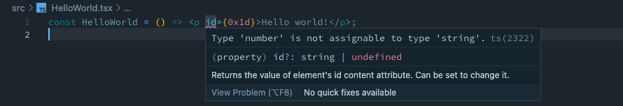

# hono-jsx-types

Enhanced type definitions for Hono's JSX intrinsic elements (WIP)

## Motivation

While Hono's JSX middleware is great for templating HTML, its type definition has a small flaw.
Since the intrinsic elements are defined as `{ [tagName: string]: Record<string, any>; }`, it accepts arbitrary attributes and values.
This potentially leads to incorrect markup and lacks autocompletion for attribute keys.

This package aims to fill the gap. Providing proper type definitions can help users catch incorrect attribute values and give them a nice autocompletion experience as shown in the pictures below.

<!-- picture here -->



## Usage

Install the package from GitHub and run a postinstall script.
For unknown reasons, this package's postinstall script runs somewhere else than the current directory, so please run it manually.


```console
npm install --save-dev yudai-nkt/hono-jsx-types
npx patch-package --patch-dir=node_modules/hono-jsx-types/patches
```


Then, add it to the `compilerOptions.types` array:

```diff
 {
   "compilerOptions": {
     "types": [
+      "hono-jsx-types"
     ],
   }
 }
```

## FAQ
### Why not contribute to Hono's core?

This package relies on the type definitions for DOM API<sup>[1]</sup> from the DefinitelyTyped's [`@types/web`](https://www.npmjs.com/package/@types/web) package, which is also included in the TypeScript standard library.
I believe Hono, as a edge/server side multi-runtime library, should depend only on TC39 and WinterCG standardization, not on WHATWG's DOM Living Standard even if the dependency is only type-level.

### Why not use the built-in `dom` library?

If this package enables it by prepending the `reference lib` directive, availability of types in `lib.dom.d.ts` is not encapsulated within the package and those types would leak into your application.
The same can be said for the declaration files under `@types` scope as well.
This is generally undesirable because most Hono applications do not target browsers.
That's why I installed `@types/web` under a custom alias, patch the package to make it into a module, and explicitly import types from it.

### Why not publish to NPM registry?

This package is more of a POC right now.
In addition to the package status, installing from GitHub should just work out-of-the-box as it only provides a type declaration file.
I'll be dogfooding the package with [my project](https://github.com/yudai-nkt/awesome-hono) before publishing, so stay tuned.

<small>[1] DOM properties are of course different from HTML attributes but their type definitions are quite helpful.</small>

## License

This repository is distributed under the MIT License.
See [LICENSE.md](./LICENSE.md) for details.
